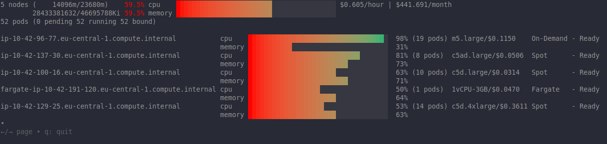

# Cluster Compute Autoscaling
Adjusting the number or size of EC2 worker nodes. There are two primary mechanisms available:
  * Kubernetes Cluster Autoscaler (CA)
  * Karpenter

## Cluster Autoscaler (CA)
The [Kubernetes Cluster Autoscaler](https://github.com/kubernetes/autoscaler) automatically adjusts the size of a Kubernetes cluster when one of the following conditions is true:
* There are pods that fail to run in a cluster due to insufficient resources.
* There are nodes in a cluster that are underutilized for an extended period of time and their pods can be placed on other existing nodes.
On AWS, Cluster Autoscaler utilizes [Amazon EC2 Auto Scaling Groups](https://github.com/kubernetes/autoscaler/tree/master/cluster-autoscaler/cloudprovider/aws) to manage node groups

An IAM role has already been created to provide Cluster Autoscaler the ability to examine and modify EC2 Auto Scaling Groups.

Install cluster-autoscaler as a helm chart:
```bash
# Set environment variables from terraform outputs
eval $(terraform -chdir=terraform output -json environment_variables | jq -r 'to_entries | .[] | "export \(.key)=\"\(.value)\""')

helm repo add autoscaler https://kubernetes.github.io/autoscaler
helm upgrade --install cluster-autoscaler autoscaler/cluster-autoscaler \
  --version "${CLUSTER_AUTOSCALER_CHART_VERSION}" \
  --namespace "kube-system" \
  --set "autoDiscovery.clusterName=${EKS_CLUSTER_NAME}" \
  --set "awsRegion=${AWS_REGION}" \
  --set "rbac.serviceAccount.name=cluster-autoscaler-sa" \
  --set "rbac.serviceAccount.annotations.eks\\.amazonaws\\.com/role-arn"="$CLUSTER_AUTOSCALER_ROLE" \
  --wait
```

### Over-Provisioning
This process of adding nodes to a cluster by modifying the ASG requires several minutes before the pods created during application scaling became available. One approach to solve the issue is "over-provisioning" the cluster with extra node(s) that run lower priority pods used as placeholders. These lower priority pods are evicted when critical application pods are deployed.

This is achieved creating `PriorityClass` Kubernetes resources and assign them to Pods. Additionally, a default `PriorityClass` can be assigned to a namespace. For a detailed explanation of how this works, refer to the Kubernetes documentation on [Pod Priority and Preemption](https://kubernetes.io/docs/concepts/scheduling-eviction/Pod-priority-preemption/).

To apply this concept for over-provisioning compute in our EKS cluster, we can follow these steps:

1. Create a priority class with a priority value of **"-1"** and assign it to empty [Pause Container](https://www.ianlewis.org/en/almighty-pause-container) Pods. These empty "pause" containers act as placeholders.

2. Create a default priority class with a priority value of **"0"**. This is assigned globally for the cluster, so any deployment without a specified priority class will be assigned this default priority.

3. When a genuine workload is scheduled, the empty placeholder containers are evicted, allowing the application Pods to be provisioned immediately.

4. Since there are **Pending** (Pause Container) Pods in the cluster, the Cluster Autoscaler will provision additional Kubernetes worker nodes based on the **ASG configuration (`--max-size`)** associated with the EKS node group.

Let's apply these updates to our cluster:
```bash
kubectl apply -k manifests/overprovisioning
kubectl rollout status -n other deployment/pause-pods --timeout 300s
kubectl get nodes -l workshop-default=yes
```
After applying these changes 2 additional nodes have been provisioned by the Cluster Autoscaler

Now scale all your deployments to 5 replicas:
```bash
kubectl get deployments -l app.kubernetes.io/created-by=eks-workshop -A \
  -o custom-columns=NS:.metadata.namespace,NAME:.metadata.name --no-headers \
  | xargs -n2 sh -c 'kubectl scale deployment -n $0 $1 --replicas=5'
```

## Karpenter
[Karpenter](https://karpenter.sh/) removes the need for managing node groups by directly provisioning instances that match the pod's requirements. This leads to a more cost-effective and flexible scaling process.

> [!IMPORTANT]
> It is not recommended to use the Kubernetes Cluster Autoscaler at the same time as Karpenter.

We install Karpenter using Helm. Various pre-requisites were created by Terraform, including:
* An IAM roles for the Karpenter controller and the nodes that Karpenter creates
* An EKS Access entry for the node IAM role so the nodes can join the EKS cluster
* An SQS queue to receive CloudWatch events, such as Spot instance interruption, instance re-balance and other

Karpenter must know which subnets and security groups to use when creating EKS instances. These subnets and security groups can be configured explicitly during the deployment of Karpenter using the Karpenter Helm chart. However, Karpenter can also automatically identify these resources if they are tagged with the key `karpenter.sh/discovery` and the value set to the name of the cluster.

This has been already deployed by Terraform. You can also deploy it manually:
```bash
# Set environment variables from terraform outputs
eval $(terraform -chdir=terraform output -json environment_variables | jq -r 'to_entries | .[] | "export \(.key)=\"\(.value)\""')

helm upgrade --install karpenter oci://public.ecr.aws/karpenter/karpenter \
  --version ${KARPENTER_VERSION} \
  --namespace karpenter --create-namespace \
  --set settings.clusterName=${EKS_CLUSTER_NAME} \
  --set settings.interruptionQueueName=${KARPENTER_SQS_QUEUE} \
  --set controller.resources.requests.cpu=1 \
  --set controller.resources.requests.memory=1Gi \
  --set controller.resources.limits.cpu=1 \
  --set controller.resources.limits.memory=1Gi \
  --wait
```

To configure Karpenter, you create [NodePools](https://karpenter.sh/docs/concepts/nodepools/) to define instance types, taints to add to provisioned nodes, node expiration, maximum amount of resources, ... Each NodePool must reference an [EC2NodeClass](https://karpenter.sh/docs/concepts/nodeclasses/) which provides the specific configuration that applies to AWS.

> [!NOTE]
> You can find some example configurations of NodePools and EC2NodeClasses for common workload scenarios in [Karpenter Blueprints for Amazon EKS](https://github.com/aws-samples/karpenter-blueprints).

This has been already deployed by Terraform. You can also deploy it manually:
```bash
kubectl kustomize manifests/karpenter/nodepool | envsubst | kubectl apply -f-
```

We'll use the following Deployment to trigger Karpenter to scale out:
```bash
kubectl apply -k manifests/karpenter/scale
```

Scale the deployment:
```bash
kubectl scale -n other deployment/inflate --replicas 8
```

> [!TIP]
> You can install [eks-node-viewer](https://github.com/awslabs/eks-node-viewer) for visualizing dynamic node usage within a cluster.

```bash
eks-node-viewer --resources cpu,memory
```


Once all the Pods are running, let’s check the instance type of the node provisioned by Karpenter:
```
$ kubectl get nodeclaim
NAME            TYPE         CAPACITY   ZONE            NODE                                             READY   AGE
default-v4t2d   c5d.4xlarge   spot       eu-central-1b   ip-10-42-129-25.eu-central-1.compute.internal   True    8m14s
```

**Consolidation**:  Karpenter will optimize your cluster's compute on an on-going basis. For example, if workloads are running on under-utilized compute instances, it will consolidate them to fewer instances. Let's explore how to trigger automatic consolidation:
1. Scale the inflate workload from 8 to 16 replicas, triggering Karpenter to provision additional capacity
1. Scale down the workload back down to 0 replicas
1. Observe Karpenter consolidating the compute

This example shows how Karpenter can dynamically select the right instance type based on the resource requirements of the workloads.

### Manual Methods
**Node Deletion**: You can use kubectl to manually remove a single Karpenter node or nodeclaim. Since each Karpenter node is owned by a NodeClaim, deleting either the node or the nodeclaim will cause cascade deletion of the other:

```bash
# Delete a specific nodeclaim
kubectl delete nodeclaim $NODECLAIM_NAME

# Delete a specific node
kubectl delete node $NODE_NAME

# Delete all nodeclaims
kubectl delete nodeclaims --all

# Delete all nodes owned by any nodepool
kubectl delete nodes -l karpenter.sh/nodepool

# Delete all nodeclaims owned by a specific nodepoolXS
kubectl delete nodeclaims -l karpenter.sh/nodepool=$NODEPOOL_NAME
```

**NodePool Deletion**: NodeClaims are owned by the NodePool through an owner reference that launched them. Karpenter will gracefully terminate nodes through cascading deletion when the owning NodePool is deleted.

> [!NOTE]
> For a more thorough set of hands-on exercises please see the [Karpenter Workshop](https://catalog.workshops.aws/karpenter).
