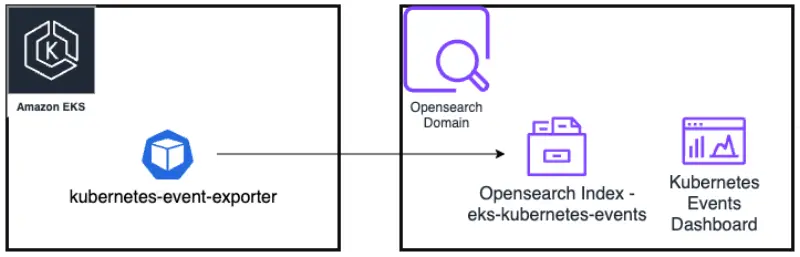
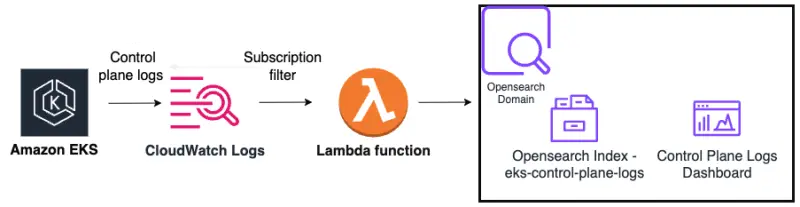
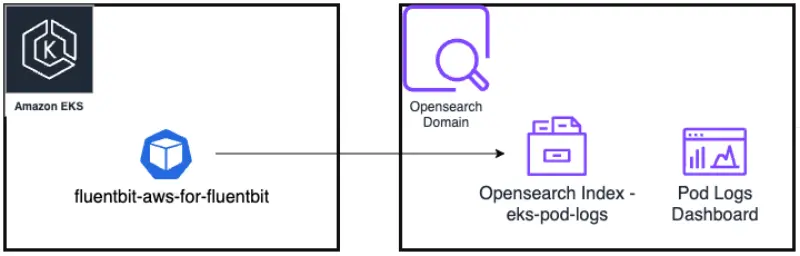

# Logging
AWS provides solutions for logging and alarming of EKS environments.
* Native services: CloudWatch Logs
* Open source managed services: Amazon OpenSearch Service

## CloudWatch Logs
Kubernetes logging can be divided into control plane logging, node logging, and application logging.

### Control Plane Logs
The following logs of the Kubernetes control plane components are available:
* Kubernetes API server component logs (`api`)
* Audit (`audit`)
* Authenticator (`authenticator`)
* Controller manager (`controllerManager`)
* Scheduler (`scheduler`)

The Terraform EKS module enables by default `["audit", "api", "authenticator"]`. See input variable [cluster_enabled_log_types](https://registry.terraform.io/modules/terraform-aws-modules/eks/aws/latest#input_cluster_enabled_log_types)

The log streams are under the CloudWatch log group name `/aws/eks/<my-cluster>/cluster`.

You can use CloudWatch Log Insights to query the EKS control plane logs. For example to identify component that is making a high volume of requests to the Kubernetes API server.

```
fields userAgent, requestURI, @timestamp, @message
| filter @logStream ~= "kube-apiserver-audit"
| stats count(userAgent) as count by userAgent
| sort count desc
```

### Pod Logs utilizing Fluentbit
Kubernetes, by itself, doesn’t provide a native solution to collect and store logs. It configures the container runtime to save logs in JSON format on the node filesystem. Container logs are written to `/var/log/pods/*.log`. Kubelet and container runtime write their own logs to `/var/logs` or to journald, in operating systems with systemd. We can implement pod-level logging by deploying a node-level logging agent as a DaemonSet on each node, such as [Fluent Bit](https://fluentbit.io/).

The [AWS for Fluent Bit](https://github.com/aws/aws-for-fluent-bit) image provides plugins to send logs to CloudWatch Logs, Kinesis Data Firehose, Elasticsearch, S3 and Opensearch.

The AWS for Fluent Bit has already been deployed with Terrraform as an EKS addon. The ConfigMap for aws-for-fluent-bit is configured to stream the container logs from each node to the CloudWatch log group with the prefix `/eks-workshop/worker-fluentbit-logs` and `/eks-workshop/fargate-fluentbit-logs`

## OpenSearch
[OpenSearch](https://opensearch.org/about.html) consists of a data store and search engine (OpenSearch), a visualization and user interface (OpenSearch Dashboards), and a server-side data collector (Data Prepper). Kubernetes events, control plane logs and pod logs can be exported from Amazon EKS to Amazon OpenSearch Service.

### Kubernetes events
We'll deploy the Kubernetes [events exporter](https://github.com/resmoio/kubernetes-event-exporter) to forward events to OpenSearch. Kubernetes events are continuously generated but retained within the cluster for only one hour by default.



### Control plane logs
To forward the control plane logs from CloudWatch Logs to OpenSearch, we configure a [CloudWatch Logs subscription filter](https://docs.aws.amazon.com/AmazonCloudWatch/latest/logs/CWL_OpenSearch_Stream.html) that will trigger a Lambda function.



### Pod logs
We'll deploy [AWS for Fluent Bit](https://github.com/aws/aws-for-fluent-bit) to forward pod logs to the OpenSearch domain.


